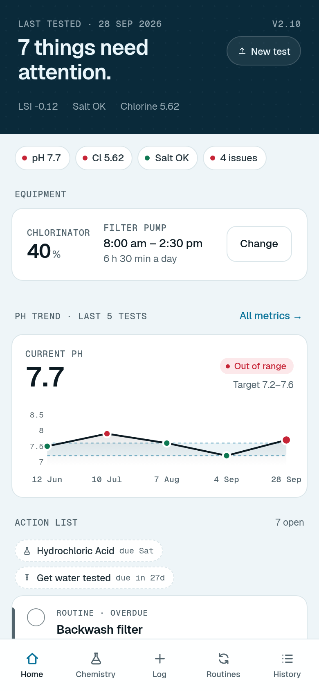
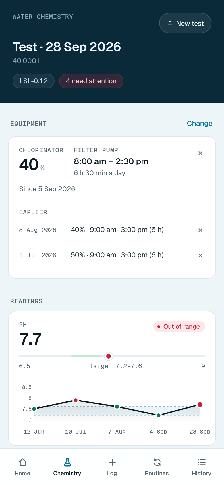
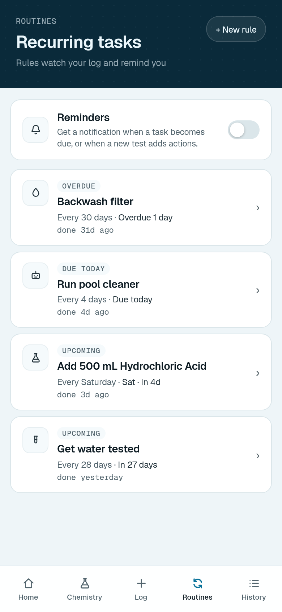
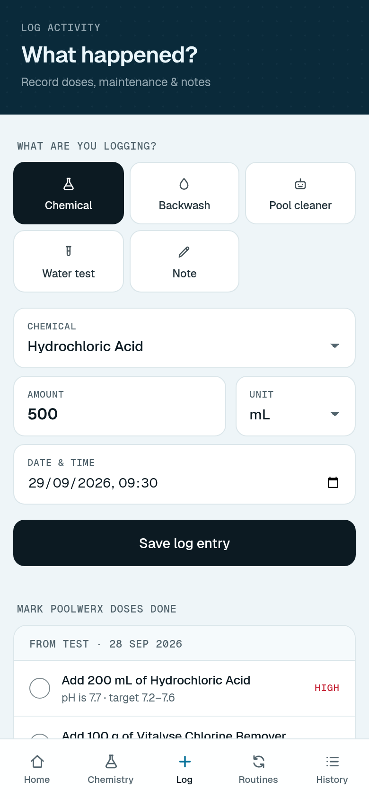
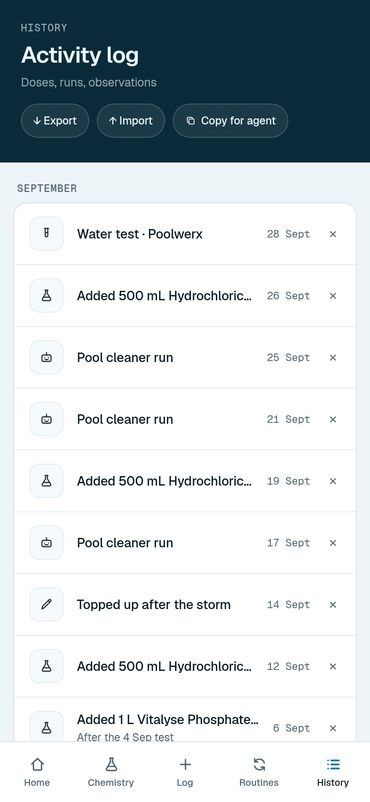

# Pool Dashboard

A simple phone app for looking after a home swimming pool.

Get your water tested at Poolwerx, upload the PDF report they email you, and
Pool Dashboard turns it into a to-do list: what to add, how much, and which
readings are out of range. It also reminds you about regular jobs like
backwashing the filter, and keeps a record of everything you've done.

It runs in your phone's web browser, and you can add it to your home screen so
it opens like any other app. There's no account to create, and nothing is
stored online: your pool's data stays on your phone.

## What it looks like

<table>
  <tr>
    <td align="center" valign="top" width="33%">
      
      <br><b>Home</b>
      <br>What needs doing, your equipment settings, and how pH is tracking
    </td>
    <td align="center" valign="top" width="33%">
      
      <br><b>Chemistry</b>
      <br>Every reading from your latest test against its target, with a chart of past tests
    </td>
    <td align="center" valign="top" width="33%">
      
      <br><b>Routines</b>
      <br>Regular jobs, with optional reminders when one is due
    </td>
  </tr>
  <tr>
    <td align="center" valign="top">
      
      <br><b>Log</b>
      <br>Record what you added or did, and tick off the doses Poolwerx recommended
    </td>
    <td align="center" valign="top">
      
      <br><b>History</b>
      <br>Everything you've logged, with backup and a summary you can paste into an AI chat
    </td>
    <td></td>
  </tr>
</table>

The latest test in these pictures is a real Poolwerx report. The earlier tests,
log entries and equipment settings are made up for the example.

## Get your own copy

You need a free [GitHub](https://github.com) account. It takes about five
minutes and doesn't involve any coding.

1. **Copy the project.** Click **Fork** at the top of this page, then
   **Create fork**.
2. **Turn on the automatic build.** In your copy, open the **Actions** tab and
   click the green button to enable workflows.
3. **Turn on the website.** Go to **Settings → Pages**. Under **Source**, choose
   **GitHub Actions**.
4. **Clear out the original owner's test results.** Your copy includes the
   latest water test from the original pool, and your app would load it the
   first time you open it. Open the `sync` folder, then the folder inside it,
   then `latest.json`. Click the pencil icon to edit it, replace everything with
   the line below, and click **Commit changes**. Saving this also starts your
   first build.

   ```json
   { "schema": 1, "reportId": null, "testedAt": null, "metrics": null, "recs": [] }
   ```

5. **Open it on your phone.** After a couple of minutes your app is live at
   `https://<your-github-username>.github.io/pool-dashboard/`. The link also
   appears under **Settings → Pages**.
6. **Add it to your home screen.** On iPhone, tap the Share button in Safari,
   then **Add to Home Screen**. On Android, open the Chrome menu and tap
   **Add to Home screen** (or **Install app**).
7. **Load your first test.** Tap **New test** and choose the PDF that Poolwerx
   emailed you.

The app at [reidstephen11.github.io/pool-dashboard](https://reidstephen11.github.io/pool-dashboard/)
is the original owner's copy. It loads their water tests automatically, which
is why you need your own.

## Try it on your computer first

If you have [Python](https://www.python.org) installed, you can run the app
without setting anything up on GitHub:

```
git clone https://github.com/reidstephen11/pool-dashboard.git
cd pool-dashboard
python3 -m http.server 8000
```

Then open <http://localhost:8000> in your browser. It starts with the owner's
latest test already loaded, so you can see how it works straight away.

## Good to know

- **Your data lives in your browser.** Clearing the browser's data for the site
  erases it. Use **History → Export** now and then to save a backup file, and
  **Import** to restore it or move it to another device.
- **It reads Poolwerx reports only.** The PDF reader is built for the report
  Poolwerx emails after a water test.
- **Reminders** work best on Android with the app added to the home screen,
  where they can arrive even when the app is closed. Elsewhere they appear
  while the app is open.
- **It works offline** once you've opened it, which helps when the pool is out
  of Wi-Fi range.
- **Automatic imports.** Instead of uploading each PDF, you can set up an email
  automation that publishes new reports for the app to pick up by itself. The
  technical notes explain the format.

## For developers

How the code is organised, the build, the report reader, reminders, offline
support and the automatic import format are all covered in
[docs/TECHNICAL.md](docs/TECHNICAL.md).

To run the tests: `npm ci && npm test`.
